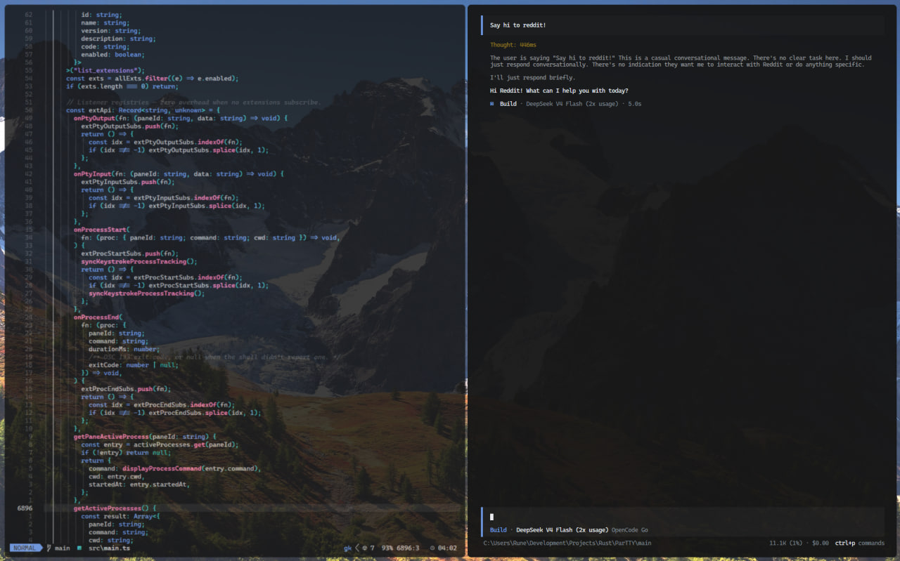

# Partty

<p align="center">
  
</p>

A fast, fun, QoL-focused terminal workspace for Windows.

Optimized for speed and minimizing latency, Partty achieves near-native input-to-render latency metrics,
as well as frame rates up to ~70% of Windows Terminal, in a Tauri WebView2 sandbox otherwise notorious for
being slow (how???).

Partty also includes a plethora of quality-of-life (QoL) features.

## Features

What does Partty give you?
Take a look:

https://github.com/user-attachments/assets/50b6efde-94e8-49dc-b8a8-38c7b454d877


### Tabs and Panes

- Fast, organic pane splits. Move panes anywhere, resize them however you want. Set them to float.
- Set a floating pane to follow, so it sticks when you move across tabs (good for watching logs,
  but switching contexts at the same time).
- Send a pane to a different tab. Pop a floating pane (set to follow) into any tab, not just its origin tab.
- Open new panes with specific profiles -- shells, ssh profiles, WSL distributions.
- Tabs, with full control; tab groups (with group colors), per-tab colors.
- Hide the tabs, traffic light buttons with "zen" via the command palette; a terminal with no distractions.
- Panes inherit the working directory of the terminal they split from, so you don't have to constantly Set-Location
  or cd to the directory you were in. They also inherit the profile/shell; if you're working with WSL, or SSH,
  a new pane split from that terminal inherits the same profile.

### Profiles 

- Custom profiling system that automatically scans for WSL distributions, local shells, git-bash;
- Make your own profiles (including SSH), ignore them so they don't show up in the list, or make a command profile;
- Inject a startup command to a pre-configured profile, so you can start a coding agent in WSL or send btop to an SSH
  connection automatically without doing so every time (treat it as a split).

### Window

- Summon and hide the window -- set the hide operation to destroy the webview, shave memory use
  to low native numbers and pop it back in immediately, returning to your workspace.
- Move your window across monitors *faster* with a custom keybind.
- Transparency or non transparency supported for the window backdrop.

### Customization

- Most, if not all, of the options that xterm.js supports in customization, Partty supports.
- Change the UI font, change the terminal font, and more.
- On top of this, Partty supports customizing almost every keybind in the application, as well as behaviors
  for split styles, borders, focus opacities, blurs, and more.
- Hide your cursor and take advantage of the first-class keyboard-only experience.
- Toggle notifications on, off. 
- Shape terminal padding, pane padding, window padding, corner radii or set terminals to square. Use the whole
  screen, or don't. Make it look how you want it to look.

### Notifications

- Be notified when a process ends *anywhere* and navigate to the terminal where it ended using the notification block.
- See what pane it's in, what process ended. If using the extensions API surface, craft customized notification systems
  to notify you based on anything that occurs in any terminal, not just process exits.

### Animation, Motion

- Tweak your animation preferences; use different look'n'feel presets, combinations, or turn them off.

### Command Palette

- Find keybind shortcuts, list running processes, panes, restart your session, quit, and more, from an easily
  accessible command palette.

### Theming

- Theme your application using several built in themes, fork an existing theme or build your own.
- Set the theme of a specific pane to differentiate it, while keeping the rest of the app with the global theme.

- Create complex theme presets using their `.toml` config files to set different cascading preferences for different
  themes; set font sizes, gaps, animation presets, and more, for one theme, and change them for another. These override
  the main `config.toml` when explicitly defined.

### Manual configuration, designed for versioning
- Configure everything how you want, store in a repository, move it where you need to and jump back in. Classic
  dotfiles style (stored under `~/.partty`).

## Performance

Against Windows Terminal, we achieve ~70% FPS on `DOOM-Fire-zig` (DFZ; an updated benchmark running
on Zig 0.16.0, counting rendered frames). This translates to about 190FPS vs a native 285FPS on WT.

Against VSCode's integrated terminal (an existing, battle-tested implementation of xterm.js),
we beat the DFZ benchmark metrics by about 3-5x.

Using the internal metrics panel on the dev build, input-to-render latency varies between incredibly low values
(1-5ms) and greater values (10-25ms), but at regular worst-case performance it never exceeds 23ms. This means
keystrokes remain incredibly responsive, competitive with existing terminal emulators for most use-cases.

## Installation

Download the binary from the releases page. From here, you can either add it to PATH or start the binary directly.
To run, you will need to have the WebView2 runtime installed (which it likely is for newer Windows Builds).

Windows Defender may flag and remove the binary during runtime, so at the moment you'll need to exempt it by
explicitly white-listing its process name and/or white-listing its path.

## Development

To run the dev build, clone the repository; then run:

``` shell
> npm install
> npm run build
> npm run tauri dev
```

This will run the dev script and start the dev build including the dev metrics panel, which is stubbed
entirely on release builds. Note you can also override the window show/hide keybind in dev builds during runtime,
which is explicitly introduced to help develop the application while using a release build of Partty simultaneously.

To build the release binary, you can run:

```shell
> npm run tauri build
```

To build a *production* binary, we'd set `LTO = "fat"`, replacing `"thin"`, to have the compiler optimize further
and shrink the binary size (which in current production builds to 9.8mb).

## Roadmap

Partty is *far from done*. Although it achieves very good performance metrics, pushing it to the very maximum
capabilities we can within the WebView2 runtime is an experimental goal -- reaching native performance under
constraint is a partial goal of the entire project.

Alongside this, I envision a rich, incredibly feature-full extension system and support for a novel Partty
Protocol ecosystem, allowing us to render images, videos, simple GUIs (in replacement or augment of TUIs) to
expand the use case and appeal of the terminal.

Some notable examples could be:

- Creating a CLI helper (or helper(s), akin to kittens in Kitty) to cast .pdf, .epub, .md, and more, directly as
  an overlay on the pane from which the cast was called.
- Creating interactive overlays in form of GUIs to extend or act as TUI alternatives.
- Rendering videos in full, lossless quality and complete render speeds, as opposed to being limited by
  terminal data streaming (stream to the front-end, render over the terminal viewport).
- Rendering images without loss of quality, with the same concept as video rendering.

A more realistic (and sensible) goal for Partty is to give the community the *tools* to do this; establish
a more capable extensions API surface, and allow optional extension of the terminal's ability to do these
sorts of experiments, rather than build them in as non-negotiable features bundled into the base application.
This respects users who just want the terminal, and respects those who want more.

## Note on Image Rendering
Image rendering within the terminal is not supported by utilizing the lone binary. The workaround is exposed
by a platform limitation I discovered, which is that Windows Terminal supports rendering Sixel, and
implementations of a terminal using raw conPTY/conhost.exe OS capabilities *do not* support this.

The solution is the same as Windows Terminal; load `OpenConsole.exe` and `conpty.dll` alongside the terminal,
and use them instead of conPTY. This enables Sixel rendering.

This is currently an early capability of Partty, and isn't bundled alongside the application,
which means you'll have to source pre-built binaries for the two from something like `nuget`, or build them
yourself.
